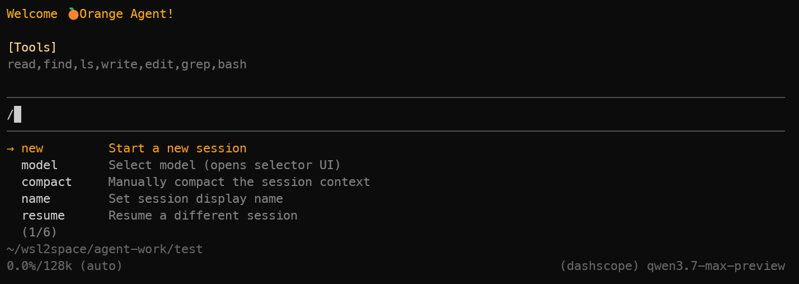
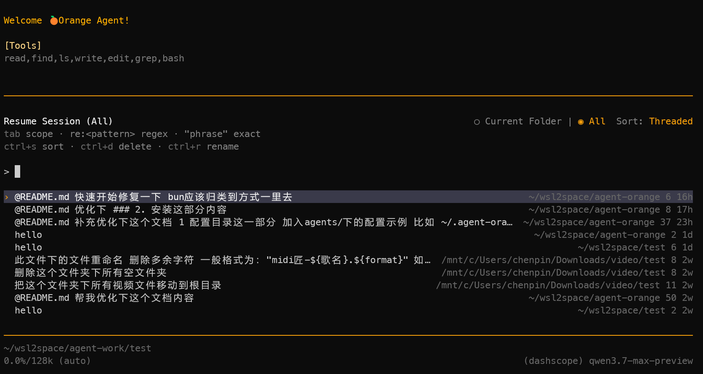
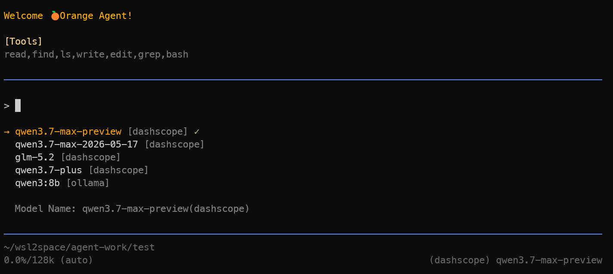

<div align="center">

# 🍊 Agent Orange

**一个基于 Bun 的终端 AI Agent 运行时（TUI），支持多模型、子代理、上下文压缩与 MCP 扩展。**

</div>

---

## 特性

- 🖥️ **终端交互界面（TUI）**：流式输出、会话管理、模型切换
- 🔌 **多模型接入**：兼容 OpenAI `completions` / `responses` 协议，支持 DeepSeek、通义千问、Ollama、OpenRouter 等
- 🧩 **子代理（Subagent）编排**：将复杂任务委派给专用子代理并行执行
- 🗜️ **上下文压缩（Compaction）**：超长会话自动/手动压缩，保留关键信息
- 🛠️ **内置工具集**：bash、文件读写编辑、grep / find 搜索等
- 🔗 **MCP 扩展**：通过 Model Context Protocol 接入外部能力
- 🎨 **主题系统**：内置主题

---

## 快速开始

### 1. 安装 Agent Orange

选择以下任一方式全局安装：

**方式一：Bun（推荐）**

如尚未安装 Bun：

```bash
curl -fsSL https://bun.sh/install | bash
```

> 项目要求 Node `>=22.19.0`，推荐使用 Bun 运行时。

然后全局安装：

```bash
bun add -g orange-agent-harness
```

> 💡 推荐使用 Bun 安装，启动速度更快，且与项目运行时保持一致。

**方式二：npm**

```bash
npm install -g orange-agent-harness
```

**方式三：免安装直接运行**

无需全局安装，通过 `npx` 临时下载并启动：

```bash
npx orange-agent-harness
```

### 2. 启动 Agent 运行时

```bash
orange
```

---

## 项目截图

功能特性
<p align="center">
  
</p>

会话恢复
<p align="center">
  
</p>

模型选择
<p align="center">
  
</p>

## 配置目录

所有配置位于 `~/.agent-orange/`，目录结构如下：

```
~/.agent-orange/
├── models.json       # 模型与提供商配置
├── settings.json     # 运行时设置（主代理角色、默认模型等）
├── plugins.json      # MCP 服务定义与技能路径
├── agents/           # 代理角色配置（*.toml）
│   ├── default.toml  # 主代理（默认角色）
│   └── web-researcher.toml  # 子代理示例
├── sessions/         # 会话持久化
├── bin/              # 内置工具二进制（rg / fd 等）
├── python-runtime/   # Python 运行时（uv 管理）
└── skills/           # 技能目录
```

> 首次启动时会自动创建该目录及默认配置文件。

### settings.json — 运行时设置

配置文件：`~/.agent-orange/settings.json`

```jsonc
{
  "masterProfile": "default",       // 主代理角色名，对应 agents/ 下的 .toml 文件名（不含扩展名）
  "defaultModel": {
    "provider": "deepseek",         // 默认模型提供商（对应 models.json 中的 key）
    "model": "deepseek-chat",       // 默认模型 ID
    "thinkingLevel": "medium"       // 思考强度：off | minimal | low | medium | high | xhigh
  }
}
```

- **`masterProfile`**：指定主代理使用的角色。默认值为 `"default"`，即加载 `agents/default.toml`。你可以在 `agents/` 下创建多个角色文件，通过修改此字段切换主代理的人格与能力。

### agents/ — 代理角色配置

目录：`~/.agent-orange/agents/`

每个 `.toml` 文件定义一个代理角色。`default.toml` 为主代理的默认角色，其余 `.toml` 文件作为**子代理（Subagent）** 供主代理按需委派任务。

#### default.toml 示例

```toml
name = "default"
description = "general-purpose agent"
developer_instructions = "You are a general-purpose AI agent that assists users with software engineering, research, analysis, and problem-solving tasks."
tools = [ "read", "find", "ls", "write", "edit", "grep", "bash" ]
mcps = [ ]
skills = [ ]
programs = [ ]
```

#### 字段说明

| 字段 | 类型 | 必填 | 说明 |
| --- | --- | --- | --- |
| `name` | `string` | ✅ | 代理名称，应与文件名一致（如 `default.toml` 对应 `"default"`） |
| `description` | `string` | ✅ | 代理描述。主代理编排时会根据此描述判断是否将任务委派给该子代理 |
| `developer_instructions` | `string` | ✅ | 系统提示词（System Prompt），定义代理的角色、行为准则与能力边界 |
| `tools` | `string[]` | ❌ | 可用工具白名单。可选值：`read`、`write`、`edit`、`ls`、`find`、`grep`、`bash`、`delegate_task`
| `mcps` | `string[]` | ❌ | 启用的 MCP 服务名称列表。名称对应 `plugins.json` 中 `mcpServers` 的 key |
| `skills` | `string[]` | ❌ | 启用的技能名称列表。技能文件从 `plugins.json` 中 `skillsPaths` 指定的目录加载 |
| `programs` | `string[]` | ❌ | 启用的程序运行环境。目前支持 `"python"`，启用后会在 `~/.agent-orange/python-runtime/` 下初始化一个基于 `uv` 的 Python 运行环境，代理可使用 `uv run` / `uv add` 执行 Python 脚本 |

#### mcps / skills 的声明与激活

`mcps` 和 `skills` 采用**声明-激活分离**的设计：

1. **声明**（定义可用资源）：在 `~/.agent-orange/plugins.json` 中声明所有可用的 MCP 服务和技能路径：

```jsonc
{
  "skillsPaths": ["/home/user/.agent-orange/skills"],
  "mcpServers": {
    "fetch": {
      "command": "npx",
      "args": ["-y", "@anthropic/mcp-fetch"]
    },
    "github": {
      "command": "npx",
      "args": ["-y", "@anthropic/mcp-github"],
      "env": { "GITHUB_TOKEN": "ghp_xxx" }
    }
  }
}
```

2. **激活**（按需启用）：在 `agents/*.toml` 的 `mcps` 和 `skills` 数组中引用已声明的名称，仅列入的项才会被加载到该代理的上下文中：

```toml
# 仅激活 fetch MCP，不激活 github
mcps = [ "fetch" ]

# 激活名为 "code-review" 的技能
skills = [ "code-review" ]
```

> 💡 这种设计使得多个代理可以共享同一份插件声明，但各自按需启用不同的子集，避免资源浪费。

#### programs 运行环境

`programs` 字段用于为代理开启本地程序执行环境。当前支持：

- **`"python"`**：启用后，系统提示中会注入 Python 环境指令，代理将使用 `~/.agent-orange/python-runtime/` 作为工作目录，通过 `uv run` 执行 Python 脚本，通过 `uv add <package>` 安装依赖。

---

## 模型配置

配置文件：`~/.agent-orange/models.json`

### API Key 读取顺序

1. **优先**读取配置文件中 provider 的 `apiKey` 字段；
2. 若未填写，则从**环境变量**读取，规则为 `${PROVIDER}_API_KEY`（provider 名称大写）。

```bash
export DEEPSEEK_API_KEY=""
export DASHSCOPE_API_KEY=""
export OPENROUTER_API_KEY=""
```

### Provider 参数

```ts
interface Provider {
    baseUrl: string    // 模型服务地址
    api: string        // 协议："openai-completions" | "openai-responses"
    apiKey?: string    // 可选，留空则读取环境变量
    models: Model[]    // 该 provider 下的模型列表
}

interface Model {
    id: string             // 模型名
    reasoning?: boolean    // 是否支持推理（思考链）
    contextWindow?: number // 上下文窗口大小
    maxTokens?: number     // 单次最大 token 限制
}
```

### 配置示例

```jsonc
{
  "providers": {
    // DeepSeek —— 通过环境变量 DEEPSEEK_API_KEY 鉴权
    "deepseek": {
      "baseUrl": "https://api.deepseek.com",
      "api": "openai-completions",
      "models": [
        { "id": "deepseek-chat" },
        { "id": "deepseek-reasoner", "reasoning": true }
      ]
    },

    // Ollama —— 本地服务，固定 apiKey
    "ollama": {
      "baseUrl": "http://192.168.0.103:11434/v1",
      "api": "openai-responses",
      "apiKey": "ollama",
      "models": [
        { "id": "qwen2.5:32b", "contextWindow": 128000, "maxTokens": 32000 }
      ]
    },

    // 通义千问（DashScope 兼容模式）—— 通过环境变量 DASHSCOPE_API_KEY 鉴权
    "dashscope": {
      "baseUrl": "https://dashscope.aliyuncs.com/compatible-mode/v1",
      "api": "openai-completions",
      "models": [
        { "id": "qwen-plus" },
        { "id": "qwen3-coder-plus" }
      ]
    }
  }
}
```

> 💡 提示：`models.json` 路径对应 `~/.agent-orange/models.json`。运行时通过 TUI 中 `/model` 命令可在已配置模型间快速切换。

---

## 上下文文件（AGENTS.md / CLAUDE.md）

Agent 启动时会自动加载项目上下文文件，用于注入项目特定的指令：

- 查找文件名：`AGENTS.md`（优先）或 `CLAUDE.md`
- 加载范围：从 `~/.agent-orange/`（全局）起，沿当前工作目录向上逐级查找祖先目录中的同名文件，去重后合并
- 适用于存放项目规范、技术栈说明、编码约定等

---

## 子代理（Subagent）

### 子代理配置示例

在 `~/.agent-orange/agents/` 下创建新的 `.toml` 文件即可定义子代理（文件名不能为 `default.toml`）：

```toml
# ~/.agent-orange/agents/web-researcher.toml
name = "web-researcher"
description = "用于联网检索、抓取网页与从在线资源提取结构化信息的专用代理"
developer_instructions = """
你是专注联网研究的子代理。
你的职责是：通过 MCP 工具抓取网页内容，提取关键信息并返回结构化结论。
不要回答与联网检索无关的问题。
"""

tools    = ["bash", "read", "grep"]   # 限定可用工具；省略则使用全部内置工具
mcps     = ["fetch"]                  # 启用 plugins.json 中声明的 fetch MCP 服务
skills   = []                         # 不启用额外技能
programs = []                         # 不需要程序运行环境
```

### 工作机制

- 主代理（orchestrator）读取 `settings.json` 中的 `masterProfile` 确定自身角色，并加载 `agents/` 下**除 default.toml 以外**的全部子代理定义，在系统提示中作为 `<available_agents>` 暴露给模型；
- 当任务匹配某个子代理的能力时，主代理调用 `delegate_task` 工具，将任务委派给子代理**独立执行**；
- 子代理仅向主代理返回**最终结论**，由主代理整合后回答用户。

```
TUI ──> /subagent 提示词 ──> session.prompt ──┐
                                              ├──> 主代理编排
TUI <── session.subscribe <── 子代理事件流 <──┘
```

> 委派原则：需要专门技能、可独立运行、或可并行执行时才委派；简单任务由主代理直接处理。

---

## 内置工具

| 工具 | 说明 |
| --- | --- |
| `bash` | 执行 shell 命令 |
| `read` | 读取文件内容（支持分页读取大文件） |
| `write` | 写入文件（不存在则创建） |
| `edit` | 基于精确文本替换的文件编辑 |
| `ls` | 列出目录内容 |
| `find` | 按 glob 模式查找文件 |
| `grep` | 按正则/字面量搜索文件内容 |
| `delegate_task` | 委派任务给子代理 |

---

## 斜杠命令（Slash Commands）

在 TUI 输入框中使用：

| 命令 | 说明 |
| --- | --- |
| `/new` | 新建会话 |
| `/model` | 打开模型选择器，切换当前模型 |
| `/compact` | 手动压缩当前会话上下文 |
| `/name` | 设置会话显示名称 |
| `/resume` | 恢复其他会话 |
| `/quit` | 退出 Agent |

---

## 内置搜索工具（rg / fd）

`~/.agent-orange/bin/` 下内置 `rg`（ripgrep）与 `fd`。若提示无执行权限：

```bash
chmod -R +x ~/.agent-orange/bin
```

验证：

```bash
~/.agent-orange/bin/rg --version
~/.agent-orange/bin/rg "openai" . | head -20
~/.agent-orange/bin/rg "openai" . -g '!node_modules/**' | head
~/.agent-orange/bin/rg "openai" . --debug
```

### rg 忽略规则

ripgrep 按以下顺序读取忽略文件：

| 文件 | 生效条件 |
| --- | --- |
| `.gitignore` | Git 仓库内（通常存在 `.git` 目录） |
| `.ignore` | 无论是否为 Git 仓库都生效 |
| `.rgignore` | ripgrep 专用，始终生效 |

---


## 上下文压缩测试用例

以下提示词可生成超长多轮对话，用于验证 `/compact` 压缩能力：

```text
我正在启动一个代号为「Project Lighthouse」（灯塔计划）的开源智能家居项目。请为我新建一个文本文件，撰写一份长达 800 字的项目愿景声明，
重点阐述为什么「边缘计算」比「云计算」更适合隐私保护。请务必在声明的最后一段提及：我们的初始启动资金是 320 万美元，且核心团队拒绝任何风险投资。

针对上述愿景，请详细对比 Zigbee 和 Z-Wave 两种协议在开源社区中的支持度。请写一篇约 1000 字的技术分析，并强制要求：在对比表格的下方，
用加粗字体写下结论——「我们最终选择 Zigbee 3.0，因为它拥有更开放的 MAC 层许可」。

现在，请虚构一位我们的典型种子用户。姓名叫「王建军」，52 岁，居住在中国成都，是一名退休的无线电工程师。请写一段 800 字的人物画像，
强调他非常介意数据被互联网大厂获取，且他的儿子在国外留学，需要通过特定端口转发才能访问家里设备。
```

---

## 开发

```bash
# 下载tsgo进行编译
npm install @typescript/native-preview -g

# 构建类型检查
bun run build

# 代码格式化
bunx prettier --write .
```

---

## License

Private
